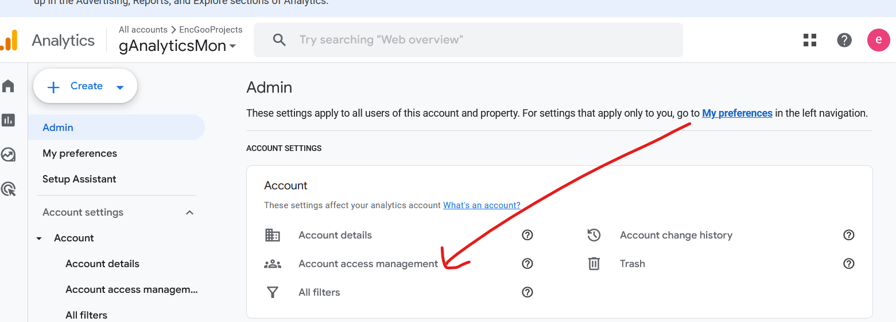
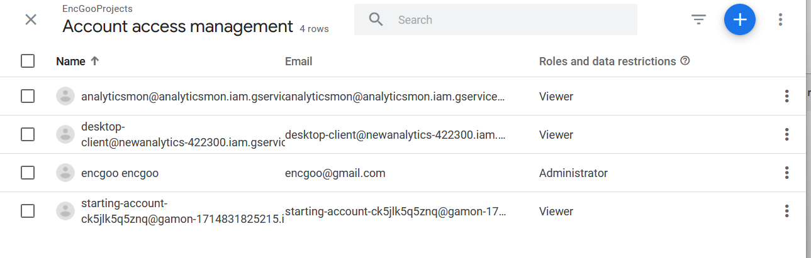
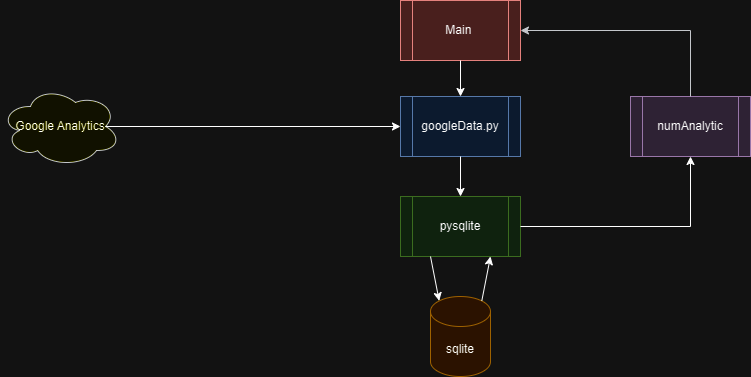

# Google Analytics Monitor
This project uses [Google Analytics Data API](https://developers.google.com/analytics/devguides/reporting/data/v1/quickstart-client-libraries#python) (NOT the Google Report API) to retrieve data from Google analytics. 

## Preparation
### Enable API
On the [API Quickstart page](https://developers.google.com/analytics/devguides/reporting/data/v1/quickstart-client-libraries#python), click "Enable the Google Analytics Data API v1". You might need to login to your google analytics account first. This will download a file to your Downloads folder. Note on Mac the content is base-64 encoded. Use a online base-64 decoder to decode the content and resave it as credentials.json.

Open this credential.json file and find the client_email field. Go to the Google Analytics 4 property you want to access, and [add this email as a new User](https://support.google.com/analytics/answer/9305788?hl=en#zippy=%2Cin-this-article). Grant Viewer permission to this new user. See  and  for adding user to encgoo gAnalytics.

### python
## python venv
venv is a virtual environemnt for running python. New python packages are installed into the venv, and it wouldn't pollute the system environment.
### start a venv
The following command starts a new venv called analytics-quickstart, which is in a folder called analytics-quickstart.
```bash
python3 -m venv google-data
```
### Enter venv
```bash
source google-data/bin/activate
```
Or on Windows
```cmd
google-data/Script/activate
```
### install 
```bash
pip install google-analytics-data
```
### end venv
```bash
deactivate
```

## Home page
Refer to the [home page](https://sites.google.com/view/ganalyticsmon/home).
## Reference
[Google Analytics API](https://developers.google.com/analytics/devguides/reporting/core/v4/quickstart/installed-py)

## Design
Here is the dataflow diagram

The main component controls the googleData component to retrieve data from GA4. Data is then sent to pysqlite to write to Database. 
### Database
A sqlite database is used to stored data. Database access is encapsulated in pysqlite.py

### Data analytics
Numpy is used to do analytics.

### googleData
GA4 API is used to retrieve data from GA4.


## Dependencies
Need to pip install the following packages into the virtual env:
* numpy
* matplotlib
* google-analytics-data

# IP reputation check
If suspicious traffic is detected by the above package, an email alert cab be sent to the admin. The admin can then go to WP Engine and download the log file.

The log file contains the IP addresses of the visitors. We can then analyze the ip reputation of each IP Address.
* Google Postmaster Tools
* Sender Score by Validity
* Talos Intelligence by Cisco
* BrightCloud’s IP List
* MultiRBL
* Mail Tester
* Cyren IP Reputation Checker
* Smart Network Data Services (SNDS)

## global black list
### spamcop.net
[Reference](https://www.spamcop.net/fom-serve/cache/351.html). The logic is implemented in CheckIpAddr.py.


## local black list
We can also keep a black list of ip addresses in the database.

## Reference
A sample [python project](https://github.com/jgamblin/isthisipbad).

# Contributers
* Calvin Feng
* Justin Feng
* Yongjian Feng
